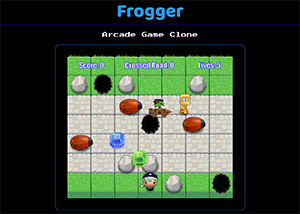

### Frontend Nanodegree Project
___

# Classic Arcade Game Clone

This game is loosley based on the classic 1981 [**video game**](https://en.wikipedia.org/wiki/Frogger), **Frogger**.  In which the players frog character negotiated roads filled with hostile vehicles to reach safety at the top of the screen.  This game is built using the HTML5 canvas element and canvas api.  This is a project from Udacity's **Frontend Nanodegree** [program](https://www.udacity.com/course/front-end-web-developer-nanodegree--nd001).
___

### Original

See original game in action: [Frogger video](https://www.youtube.com/watch?v=l9fO-YuWPSk)

### My Game

Visit: [Game](https://dar77.github.io/arcade-game/)

___

## Run Game

To run game simply download all folders and files and open index.html in browser. Game is not touch enabled so you will need a keyboard to play.
___

## Game Instructions

Maneuverer your player safely across the road and to the water at the top of the screen. Take care to avoid enemy bugs, holes and troll racers along the way! To win your score must reach 50 points and you must cross the road and reach the water 15 times or more. Good luck!

___

## Game Controls

The game can be played with keyboard arrow keys to move the player. Up, down , left and right!
___

## Game Code

The games code uses javascript **pseudo classical classes** and **subclasses** and makes use of object **prototype** to create a range of on screen instances of various game entities. These are rendered on the canvas within a gaming loop.

I made use of **jquery** to create the transitions between the various game information screens, game over, win etc.

Code follows Udacity's [style guide](http://udacity.github.io/frontend-nanodegree-styleguide/).
___

## Game / Minimum Specification
- **Player cannot move off screen**
- **Vehicles cross the screen**
- **Vehicle and player collisions happen logically (not too early not too late)**
- **Something happens when player wins**
___

## Customised Game Features

Beyond the required game elements I've added pick up items that randomly run across the screen that give various points when collected or in the case of 'heart' pick ups, give a new player life.

Also I've added game obstacles in the form of rocks and holes that the player must manoeuvre around.  Rocks block your way and holes reset the player to start position as well as losing a player life.

The Game has added score, road cross and player life counters that track the players progress.  If the score target is met before the road cross target is reached or vice versa, the text and text color changes to highlight the players current progress. When the player's life count reaches 1 the text and text color changes to red to alert player to their impending doom!

I've also added player alerts for colliding with enemies, crossing the road, collecting pick ups and falling down holes.

The player board and road size have been increased and I've added pre-game instruction screens and 'Game Over' and 'Win' screens to complete the experience.